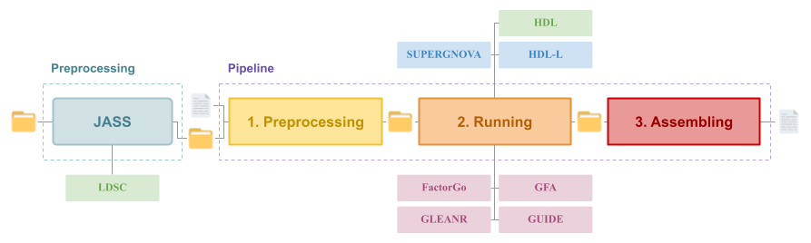

# Pleiotropy Decomposition Pipeline using GWAS summary statistics

## Overview



## Installation

```bash
# Download with https
git clone https://github.com/gloriabenoit/pleiotropy_decomposition.git
# or ssh
git clone git@github.com:gloriabenoit/pleiotropy_decomposition.git

cd pleiotropy_decomposition
```

## Documentation

For more information on:

* The pipeline itself
* The methods used
* The package versions
* The possible parameters
* And more!

Please check the [official documentation](https://gloriabenoit.github.io/PDP-Docs/).

<!-- 

This pipeline will compute results for a total of **8 methods**:

* **Global correlation methods:**
    * LDSC ([Bulik-Sullivan et al. 2015](https://pubmed.ncbi.nlm.nih.gov/25642630/), [Github repo](https://github.com/bulik/ldsc))
    * HDL ([Ning et al. 2020](https://pubmed.ncbi.nlm.nih.gov/32601477/), [Github repo](https://github.com/zhenin/HDL))
* **Local correlation methods:**
    * SUPERGNOVA ([Zhang et al. 2021](https://pubmed.ncbi.nlm.nih.gov/34493297/), [Github repo](https://github.com/qlu-lab/SUPERGNOVA))
    * HDL-L ([Li et al. 2025](https://pubmed.ncbi.nlm.nih.gov/40065165/), [Github repo](https://github.com/zhenin/HDL))
* **Latent factor analysis methods:**
    * FactorGo ([Zhang et al. 2023](https://pubmed.ncbi.nlm.nih.gov/37879338/), [Github repo](https://github.com/mancusolab/FactorGo))
    * GFA ([Morrison et al. Preprint](https://www.researchsquare.com/article/rs-4714610/v1), [Github repo](https://github.com/jean997/GFA))
    * GLEANR  ([Omdahl et al. 2025](https://pubmed.ncbi.nlm.nih.gov/40730164/), [Github repo](https://github.com/aomdahl/gleanr))
    * GUIDE ([Lazarev et al. Preprint](https://pubmed.ncbi.nlm.nih.gov/38766146/), [Github repo](https://github.com/daniel-lazarev/GUIDE))

**Before** you can run it, you need to use [JASS analysis pipeline](https://gitlab.pasteur.fr/statistical-genetics/jass_suite_pipeline) to harmonize your GWAS summary statistics as well as run LDSC. The output folder of this pipeline is the **main input** of ours.

The pipeline can be divided into separate parts:

* **Preprocessing**: format every input file
* **Running**: run each method independantly
* **Assembling**: summarize results into a single file

## Installation
### Pipeline

```bash
# Download with https
git clone https://github.com/gloriabenoit/pleiotropy_decomposition.git
# or ssh
git clone git@github.com:gloriabenoit/pleiotropy_decomposition.git

cd pleiotropy_decomposition
```

### Original Github repositories

Some methods need additionnal files to run, which are available on the original Github repositories.
We will clone each of them  since some are necessary but also as a way to give credit.

```bash
sh ./src/clone_repos.sh
```

### Dependencies

The methods have their own dependencies, therefore we will create a new virtual environnement for each.

```bash
sh ./src/dependencies/create_venv.sh
```

> Please note that this step takes quite some time, thankfully you only need to do it once.

### Additional files

In order to run HDL and HDL-L, we need a global reference panel and a local reference panel.
Both are officially provided, we simply need to download them.

> Please be aware that these files are quite heavy (33G for the global panel and ~2G for the local one).

As input, SUPERGNOVA needs plink bfiles. An example can be downloaded on the [official repository](https://github.com/qlu-lab/SUPERGNOVA).
However if you wish to use another reference, which is our case, please make sure that the bim files have values for their positions (in centimorgans).
If not, SUPERGNOVA will crash, which is why we will extrapolate them with a [GRCh38 positions map](https://alkesgroup.broadinstitute.org/Eagle/downloads/tables/).

> To indicate whether positions need to be extrapolated, please update the value of `extrapolate_pos` in `./config/SUPERGNOVA_arguments.txt`.

```bash
sh ./src/get_files.sh
```

## Before using the pipeline

The JASS analysis pipeline is described in great detail on the [official page](https://gitlab.pasteur.fr/statistical-genetics/jass_suite_pipeline).
You have to use it to harmonize the GWAS summary statistics you wish to analyze.
You also have to make sure that `params.compute_LDSC_matrix` in the `jass_pipeline.nf` file is set to `true`, in order to run LDSC.

> This step is absolutely **necessary** to run our pipeline and will results in an error otherwise.

## How to use
### Parameters

You can alter the parameters of the pipeline as well as the methods by changing the values of the `{step}_arguments.txt` files in the `./config/` folder.

By default, we will apply the preprocessing filters suggested in each article.
However, it is also possible to provide a list of SNPs to analyze, so that every methods has the same input.
This list will replace the preprocessing steps for latent factors analysis methods (FactorGo, GFA, GLEANR, GUIDE), but not the global and local correlation methods (LDSC, HDL, SUPERGNOVA, HDL-L).

> To indicate whether you want to apply the original filters or use a list of SNPs, please update the value of `use_filters` in `./config/pipeline_arguments.txt`.

### Running

The three steps of our pipeline can be run separately.

```bash
sh run_preprocessing.sh
sh run_pipeline.sh
sh run_assembly.sh
```

> As of now, the steps need to be launched manually one after the other once they're complete. -->
